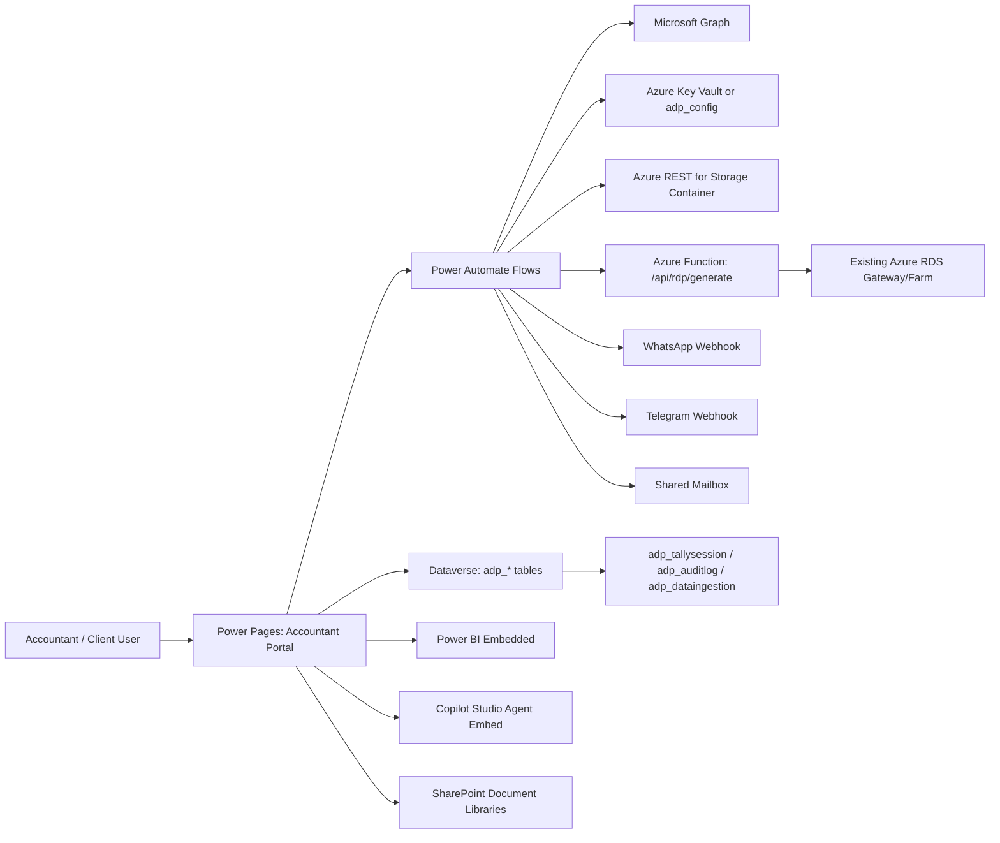

# Accountant Delivery Platform - Power Platform Scaffold

This repository implements a low-code-first architecture where Power Pages is the front door and Dataverse is the system of record. It replaces the proposed custom web stack (Next.js + Azure SQL + Azure Functions) with managed platform services while preserving one minimal custom endpoint for signed RDP file generation.

## What this replaces
- Replaced custom portal UI: Power Pages site (Dataverse starter-based) under `portal/`.
- Replaced SQL schema and API layer: Dataverse tables, choices, relationships, and security under `solution/src/customizations.xml`.
- Replaced most Azure Functions: Power Automate flows under `flows/`.
- Kept one custom endpoint only where native low-code is insufficient: `apps/rdp-function`.

## Architecture diagram

## Folder map
- `solution/`: Unpacked Dataverse solution source.
- `portal/`: Power Pages source and Liquid templates.
- `flows/`: Exported flow JSON templates and setup notes.
- `power-query/`: Starter Power Query templates (.pq).
- `custom-connectors/`: OpenAPI + connector property definitions.
- `scripts/`: PAC helper scripts for init/pull/push/deploy.

## Prerequisites
- Power Platform CLI (`pac`) installed.
- VS Code extension: Power Platform Tools.
- Access to Power Platform environments (dev/test/prod).
- Power Pages licensing (external authenticated users or pay-as-you-go).
- Power Automate premium licensing for HTTP/custom connector/Azure connector usage.
- Power BI Pro/PPU for workspace/report lifecycle.

## First-time setup
1. Install tools and authenticate.
   - `pac auth create --kind ADMIN --tenant <tenant-id>`
2. For local developer machine setup and test execution, follow `LOCAL-PC-TESTING.md`.
3. Run initialization script.
  - `pwsh ./power-platform/scripts/init.ps1 -TenantId <tenant-id> -DevEnvironmentName <dev> -TestEnvironmentName <test> -ProdEnvironmentName <prod> -Location <region> -Currency INR -Language 1033`
4. Open Portal Management and confirm site pages/web roles are created.
5. Import or recreate flows from `flows/*.json` and bind connection references.
6. Configure environment variables and secrets (Key Vault preferred).
7. Deploy `apps/rdp-function` and configure function key in flow env vars.
8. Set portal authentication to Entra ID only (multi-tenant).

## Entra ID setup (Power Pages as only IdP)
1. Register app in Entra ID:
   - Supported account types: Multitenant.
   - Redirect URI: `https://<portal-domain>/signin-oidc`.
   - Logout URL: `https://<portal-domain>/signout-callback-oidc`.
2. Create client secret/certificate.
3. Grant Graph permissions needed by flows (Group.ReadWrite.All, User.Invite.All, Sites.FullControl.All as required).
4. In Power Pages authentication settings:
   - Disable local auth providers.
   - Enable Microsoft Entra ID provider only.
   - Set client id, authority, metadata endpoint.
5. Validate login flow with external B2B guest and internal accountant accounts.

## Power Pages pages included
- `/` landing with M365 sign in CTA.
- `/dashboard` tile-based module launcher.
- `/companies` onboarding form + list (for accountant/admin).
- `/documents` SharePoint integration placeholder.
- `/reports` Power BI embed placeholder.
- `/assistant` Copilot Studio embed placeholder.
- `/inbox` Dataverse-driven data ingestion list using FetchXML.
- `/launch-tally` POST trigger to Flow_LaunchTally.

## Dataverse model summary
Core tables:
- `adp_company`
- `adp_appuser`
- `adp_entitlement`
- `adp_tallysession`
- `adp_dataingestion`
- `adp_auditlog`
- `adp_config` (secret/config option)

The full schema (columns, choices, relationships, indexes) is in `solution/src/customizations.xml`.

## Security model
- Dataverse roles: ADP Admin, ADP Accountant, ADP Client User.
- Row-level access strategy:
  - Preferred: owner teams per company.
  - Alternate: business unit segmentation.
- Power Pages web roles mirror Dataverse roles.
- Table permissions restrict Client User to own company and related rows.
- Column-level security enabled on:
  - `adp_company.adp_gstin`
  - `adp_config.adp_value`

Detailed mapping: `portal/security-model.md`.

## Flow catalog
- `Flow_OnboardCompany`: Provision Entra group, SharePoint site/libraries, storage container, Power BI workspace.
- `Flow_InviteUser`: B2B guest invite + adp_appuser row.
- `Flow_LaunchTally`: Validate entitlement, call RDP function, audit session.
- `Flow_IngestEmail`: Shared mailbox pipeline with AI classification.
- `Flow_IngestWhatsApp`: Webhook ingestion pipeline.
- `Flow_IngestTelegram`: Webhook ingestion pipeline.

## Power BI and Power Query
- Flow_OnboardCompany provisions workspace naming convention: `ADP - {CompanyName}`.
- `/reports` page is intended for Power BI component with RLS filtered by company.
- Starter .pq templates are under `power-query/` for Tally extract, bank statement, and GST reconciliation.

## Copilot Studio integration
1. In Copilot Studio, open the already-built Smart Agent.
2. Use Add to Power Pages and select the Accountant Portal site.
3. Pass company context:
   - Map signed-in company id (`adp_companyid`) into a bot variable (example: `companyId`).
4. For authenticated handoff:
   - Reuse the same Entra app registration as portal authentication where possible.
   - Configure OAuth connection in Copilot Studio channel settings.

## ALM and deployment
Local scripts:
- `scripts/pull.ps1`: export/unpack solution + download portal from dev.
- `scripts/push.ps1`: pack/import solution + upload portal to dev.
- `scripts/deploy.ps1`: managed promotion across environments.

CI/CD:
- `.github/workflows/power-platform.yml`
- Pipeline sequence:
  1. Export from dev.
  2. Unpack/pack validation in source.
  3. Deploy to test.
  4. Deploy managed build to prod (with GitHub Environment approvals).

## Environment variables and connection references per environment
Environment variables (minimum):
- `adp_AzureStorageApiBase`
- `adp_AzureStorageApiKey`
- `adp_AzureStorageContainerBase`
- `adp_PortalUrl`
- `adp_RdpFunctionBaseUrl`
- `adp_RdpFunctionKey`
- `adp_IngestionMailbox`
- `adp_UseAIBuilder`
- `adp_AIBuilderModelId`
- `adp_DocIntelEndpoint`
- `adp_DocIntelKey`
- `adp_SharePointSiteUrl`
- `adp_WhatsAppAccessToken`
- `adp_TelegramBotToken`

Connection references (minimum):
- Dataverse
- Microsoft Graph
- SharePoint Online
- Office 365 Outlook
- Power BI
- AI Builder (optional if using Doc Intelligence path)

## Troubleshooting
- `pac pages download` fails:
  - Confirm Website ID and environment selection with `pac org who` and `pac pages list`.
- Solution import fails due to missing connection references:
  - Pre-create connection references in target environment or include deployment settings file.
- Flow HTTP triggers return 401/403:
  - Regenerate trigger URL, verify flow run-only permissions, and API keys.
- Power BI embed blank page:
  - Confirm workspace access, embed settings, and RLS role mapping.
- Copilot agent does not receive company scope:
  - Verify bot variable mapping from page context and authentication claims.
